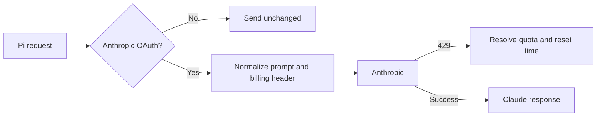

# pi-claude-oauth-adapter

Use a Claude Pro or Max subscription with [Pi](https://github.com/badlogic/pi-mono).

[](https://www.npmjs.com/package/pi-claude-oauth-adapter)
[](./LICENSE)

```bash
pi install npm:pi-claude-oauth-adapter
```

This extension adapts Pi's built-in Anthropic OAuth flow to the request format expected by Claude's subscription backend. It does not implement OAuth or bypass usage limits.

## Setup

1. Install the package.
2. Start Pi and run `/login`.
3. Choose **Claude Pro/Max**.
4. Select an Anthropic model with `/model`.

The footer should show `✓ Claude OAuth ready`, then `✓ Claude OAuth active` after the first request.

The adapter runs only when both conditions are true:

- the provider is `anthropic`
- Pi is using OAuth

Requests using `ANTHROPIC_API_KEY` are unchanged.

## What it changes



For Anthropic OAuth requests, the adapter:

- removes Pi's docs block and any conflicting Claude Code identity block from the system prompt
- reinjects Pi docs as hidden context when the user asks about Pi
- adds or updates the Claude billing header
- turns generic `429` responses into Claude-style limit and reset messages

On an ambiguous `429`, it checks Anthropic's OAuth usage endpoint and falls back to a minimal Haiku request. Results are cached for 30 seconds.

## Status

| Footer text | Meaning |
| --- | --- |
| `✓ Claude OAuth ready` | OAuth was detected and setup is valid. |
| `✓ Claude OAuth active` | A request was normalized. |
| `⚠ Claude OAuth setup` | Required Pi docs context could not be found. |
| `You've hit your ... limit` | Anthropic reported a subscription limit. |

No status appears for API-key sessions or other providers.

## Configuration

No configuration is required for normal use.

| Variable | Default | Purpose |
| --- | --- | --- |
| `PI_CLAUDE_OAUTH_REINJECT_SCOPE` | `pi-only` | `pi-only`, `always`, or `never` |
| `PI_CLAUDE_OAUTH_REINJECT_MODE` | `prepend-custom-message` | `prepend-custom-message`, `append-custom-message`, `user-reminder`, or `none` |
| `PI_CLAUDE_OAUTH_DOCS_FILE` | unset | Fallback file containing Pi docs context |
| `PI_CLAUDE_OAUTH_LOG_FILE` | unset | JSONL debug log path |
| `PI_CLAUDE_CODE_VERSION` | bundled version | Claude Code version in request metadata |
| `PI_CLAUDE_CODE_ENTRYPOINT` | `pi` | Billing-header entrypoint |
| `PI_CLAUDE_CODE_WORKLOAD` | unset | Optional workload metadata |
| `PI_CLAUDE_CODE_SUBSCRIPTION_TYPE` | unset | Plan type used for limit labels |

Example:

```bash
PI_CLAUDE_OAUTH_REINJECT_SCOPE=always pi
```

Debug logs may contain prompt excerpts and request metadata. Review and redact them before sharing.

## Install from source

```bash
git clone https://github.com/minzique/pi-claude-oauth-adapter.git
pi install ./pi-claude-oauth-adapter
```

To test a checkout without installing it:

```bash
pi -e ./pi-claude-oauth-adapter
```

## Troubleshooting

If no status appears, check `pi list`, select an Anthropic model, and log in through **Claude Pro/Max** instead of an API key.

If `⚠ Claude OAuth setup` appears, provide the docs context explicitly:

```bash
PI_CLAUDE_OAUTH_DOCS_FILE=/absolute/path/to/pi-docs-only.txt pi
```

To collect a debug log:

```bash
PI_CLAUDE_OAUTH_LOG_FILE="$PWD/claude-oauth-debug.jsonl" pi
```

Report bugs on [GitHub](https://github.com/minzique/pi-claude-oauth-adapter/issues). See the [changelog](./CHANGELOG.md) for release notes.

## Development

```bash
npm install
npm run check
npm pack --dry-run
```

The extension entry point is [`extensions/index.ts`](./extensions/index.ts).

## Security

Pi extensions run with your user account's permissions. Review third-party extension code before installing it.

This adapter sends no telemetry and writes no logs unless `PI_CLAUDE_OAUTH_LOG_FILE` is set. Quota checks go to the configured Anthropic endpoint. The first-party OAuth usage endpoint is used only for `api.anthropic.com` sessions.

This project is unofficial and is not affiliated with Anthropic.

## License

[MIT](./LICENSE)
